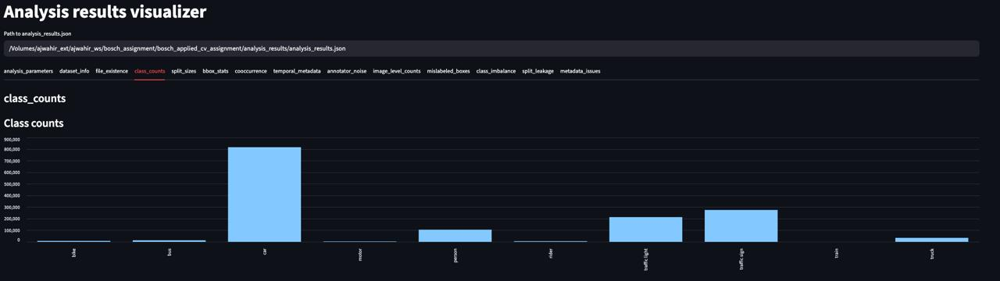
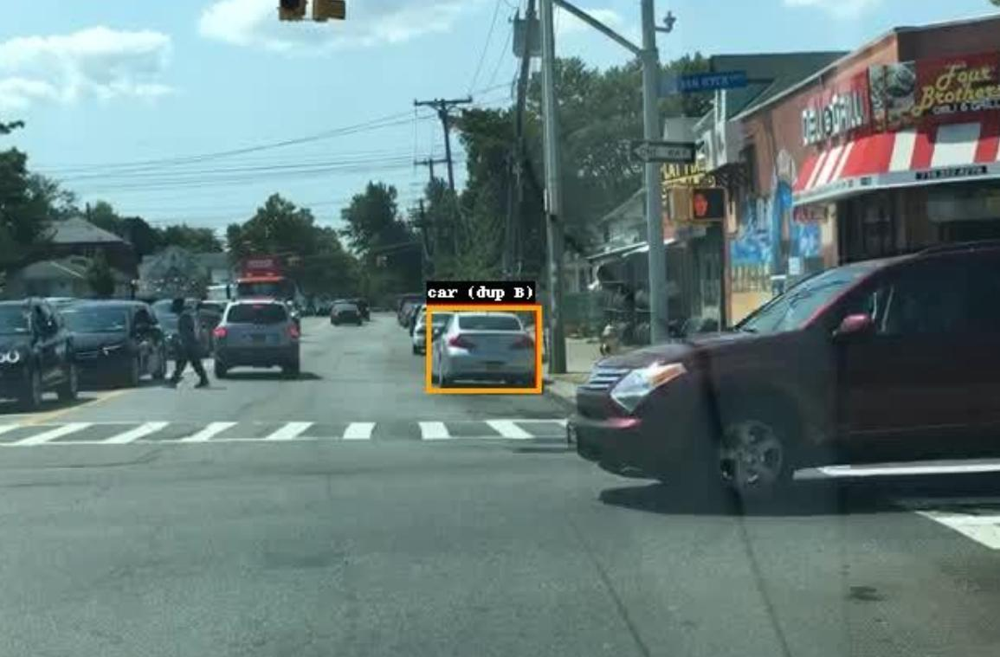
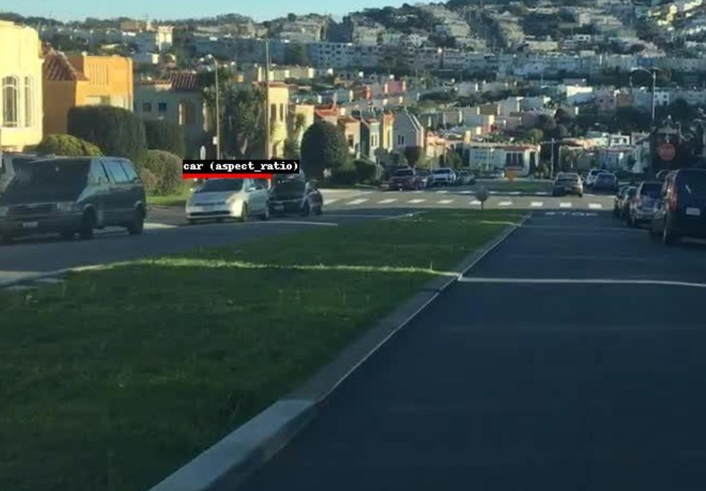
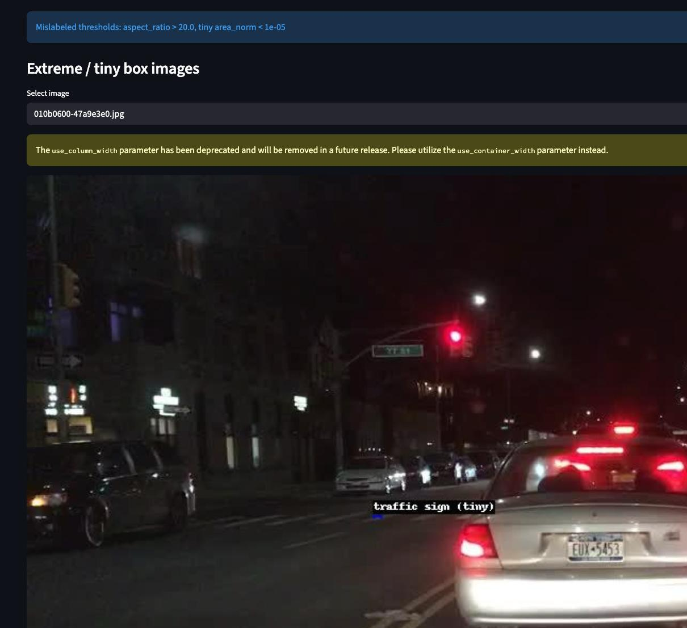

# 1. Data Analysis (10 points)

## Objective

The first part of the assignment focuses on **analyzing the BDD100K dataset** for the task of **object detection**.  
The goal is to perform exploratory data analysis (EDA) to understand dataset quality, distribution, anomalies, and labeling consistency for the **10 detection classes** with bounding boxes such as `car`, `person`, `traffic light`, `traffic sign`, etc.  
Semantic segmentation data (e.g., drivable area, lane markings) is excluded from this analysis.

---

## Dataset Overview

- **Dataset:** [BDD100K](https://bdd-data.berkeley.edu/)
- **Data used:**
  - 100K images (5.3 GB)
  - Bounding box labels (107 MB)
- **Focus:** 10 object detection classes
- **Excluded:** Drivable areas, lane markings, and semantic segmentation data

The dataset contains annotated images with bounding boxes, scene attributes (weather, time of day, scene type), and metadata used for further statistical and quality analyses.

---

## Code Structure

```
tasks/1_data_analysis/
│
├── analysis_bdd100k.py        # Main data analysis script (EDA + QC)
├── visualize_analysis.py      # Streamlit app for visualizing results
└── README.md                  # Documentation (this file)
```

---

## Analysis Methodology

The analysis consists of two major parts:

1. **Automated Dataset Analysis (`analysis_bdd100k.py`)**
2. **Interactive Visualization (`visualize_analysis.py`)**

### 1. Automated Dataset Analysis

The script `analysis_bdd100k.py` loads the BDD100K dataset and performs multiple analyses on both **train** and **val** splits.  
It computes and saves all results in a structured JSON format (`analysis_results/analysis_results.json`).

#### Steps Performed

| Step | Description |
|------|--------------|
| **1. Dataset Info** | Counts number of images and annotations in train/val splits and checks paths. |
| **2. File Existence Check** | Detects missing or unmatched image-annotation pairs. |
| **3. Classwise Distribution** | Counts number of objects per class and measures imbalance. |
| **4. Split Sizes** | Summarizes the number of annotated images per split and any missing images. |
| **5. Bounding Box Statistics** | Computes per-class box area distribution (min, mean, median, max). |
| **6. Co-occurrence Matrix** | Finds frequently co-occurring object pairs (e.g., car–person). |
| **7. Temporal and Metadata Correlation** | Analyzes class frequency across weather, time of day, and scene type. |
| **8. Annotator Noise Detection** | Identifies duplicate overlapping boxes with high IoU (possible labeling errors). |
| **9. Image-Level Object Counts** | Detects empty images or images with many small objects. |
| **10. Mislabeled Box Detection** | Flags boxes with extreme aspect ratios, tiny sizes, or out-of-bound coordinates. |
| **11. Class Imbalance & Rare Class Examples** | Identifies underrepresented classes and stores example images. |
| **12. Split Leakage Check** | Detects if the same image appears in both train and validation splits. |
| **13. Metadata Consistency** | Reports invalid or unexpected metadata entries (weather, scene, etc.). |

The script saves example images for:
- **Extreme / tiny boxes** under `analysis_results/analysis_extreme_boxes`
- **Annotator noise** under `analysis_results/analysis_annotator_noise`

Each analysis method contributes one structured key to the master JSON for modular and independent usage.

---

### 2. Visualization Dashboard

The visualization script `visualize_analysis.py` provides an **interactive dashboard** using **Streamlit**.  
It displays all metrics, statistics, and example images in organized tabs.

#### Tabs Overview

| Tab | Description |
|-----|--------------|
| **dataset_info** | Displays dataset and path metadata. |
| **class_counts** | Visual bar chart of class distribution. |
| **bbox_stats** | Box size statistics across classes. |
| **cooccurrence** | Top object co-occurrence pairs. |
| **temporal_metadata** | Object distribution by weather/time/scene. |
| **annotator_noise** | View examples of overlapping duplicate boxes. |
| **mislabeled_boxes** | Shows examples of extreme/tiny/outside boxes. |
| **image_level_counts** | Distribution of object counts per image. |
| **metadata_issues** | Summary of metadata consistency checks. |

---

## How to Run

### Step 1: Run Dataset Analysis

```bash
# From repository root
cd tasks/1_data_analysis
python analysis_bdd100k.py
```

This will:
- Load the dataset annotations from `data/bdd100k_labels_release/`
- Compute all dataset-level statistics
- Save results in:

```
analysis_results/analysis_results.json
analysis_results/analysis_extreme_boxes/
analysis_results/analysis_annotator_noise/
```

Example console output:
```
Wrote analysis_results/analysis_results.json
```

---

### Step 2: Run the Visualization Dashboard

```bash
cd tasks/1_data_analysis
streamlit run visualize_analysis.py
```

After launching, open the provided URL in your browser (default: http://localhost:8501).

By default, the dashboard automatically loads:
```
analysis_results/analysis_results.json
```

---

## Output Structure

```
analysis_results/
│
├── analysis_results.json            # Master JSON with all computed metrics
├── analysis_extreme_boxes/          # Sample images with extreme/tiny boxes
└── analysis_annotator_noise/        # Images with duplicate annotations
```

---

### Detailed Insights and Observations

Based on the outputs of `analysis_results.json` and visualizations under the `screenshots/` directory, several insights were derived from the dataset analysis:

#### 1. Class Distribution and Imbalance
The **class distribution** shows a strong skew toward the `car` category, which dominates with **815,717** annotations.  
Next come `traffic sign` (274,594) and `traffic light` (213,002), while classes like `train` (151), `motor` (3,454), `bike` (8,217), and `rider` (5,166) are significantly underrepresented.  
This heavy imbalance could bias model learning toward dominant classes, so techniques like weighted sampling or augmentation are recommended.



#### 2. Annotator Noise (Duplicate Boxes)
The analysis detected **15 duplicate annotations** with an IoU above 0.95, suggesting occasional **annotator redundancy**.  
While minor compared to the dataset size, these overlaps (stored under `analysis_results/analysis_annotator_noise/`) can affect loss computation during training and should ideally be cleaned.



#### 3. Extreme Aspect Ratio Boxes
A total of **66 bounding boxes** were flagged with **extreme aspect ratios** (greater than 20:1).  
These boxes likely indicate misaligned or stretched annotations and can be visualized in `screenshots/ext_asp.jpeg`.  
Such samples are uncommon but can impact bounding box regression loss, making it beneficial to filter or adjust them during preprocessing.



#### 4. Tiny or Very Small Bounding Boxes
There are **96 bounding boxes** with normalized areas below **1e-05**, often representing faraway traffic lights or signs.  
Such small boxes may lack enough pixels for meaningful detection, highlighting the importance of using multi-scale architectures like FPN to preserve small-object features.



#### 5. Image-Level Object Counts
Out of **79,863** analyzed images, around **55,393** contain a **high number of small objects**.  
This suggests many crowded urban scenes with multiple cars, signs, and pedestrians per frame, requiring models capable of managing dense object distributions.

#### 6. Metadata Patterns
From the metadata:
- **Time of day:** 41,986 daytime, 31,900 night, and 5,805 dawn/dusk images.
- **Scene:** Majority are **city street (49,628)** followed by **highway (19,878)**.
- **Weather:** Clear (42,690) and overcast (10,009) dominate, with **9,276 undefined weather entries** needing cleanup.

These observations indicate well-diversified conditions, although incomplete metadata should be addressed for consistency.

---

### Quantitative Summary

| Metric | Value | Observation |
|--------|--------|-------------|
| Total images analyzed | 79,863 | Matches train/val split count |
| Duplicate boxes (annotator noise) | 15 | Minor redundancy |
| Extreme aspect ratio boxes | 66 | Potential mislabels |
| Tiny bounding boxes | 96 | Very small objects |
| Images with dense small objects | 55,393 | High traffic density scenes |
| Undefined weather entries | 9,276 | Metadata gaps |

---

### Key Takeaways

- **Severe class imbalance** toward car and traffic-related classes.  
- **Minor annotation errors** detected in the form of duplicate and extreme-aspect boxes.  
- **Diverse scene coverage** across time and weather conditions, but some incomplete metadata.  
- **Dense object environments** require detectors with good multi-scale handling (e.g., Faster R-CNN + FPN).  

These insights ensure a solid understanding of dataset quality and guide model selection and preprocessing strategies.


---

## Summary

This analysis provides:
- Comprehensive dataset understanding for object detection tasks
- Quality control checks for annotation and metadata
- Reproducible, modular, and visual exploration of the BDD100K dataset
- The variables used to derive some insights like for extreme aspect ratio were not properly engineered it is just to show that they exist, in real training this has to be correctly engineered.

The resulting metrics and visualizations together enable robust pre-model data validation and insight-driven decision-making for the later modeling and evaluation stages.