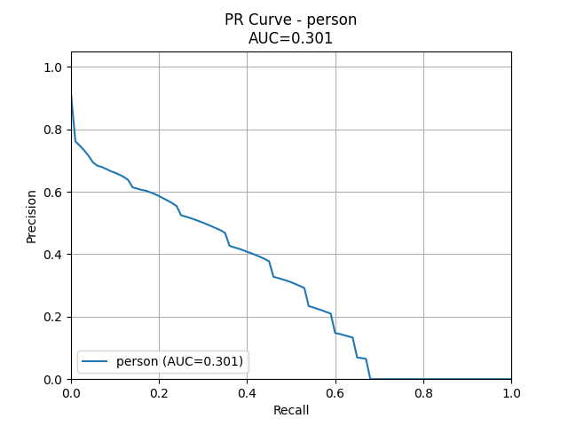

# Evaluation and Visualization (10 points)

## 1. Introduction
The goal of this assignment is to evaluate an object detection model on the **BDD100K validation dataset** and provide both **quantitative** and **qualitative** analysis. The evaluation connects numerical metrics with visual insights to identify strengths, weaknesses, and actionable improvements.

## 2. How to Run

### Step 1: Convert BDD100K labels to COCO format
```bash
python scripts/convert_bdd100k_to_coco.py
```
### Step 2: Add the changes to the BDD100K model dir
```bash
cp bdd_zoo_rep_patches/bdd100k.py bdd100k-models/det/configs/_base_/datasets/bdd100k.py
cp bdd_zoo_rep_patches/bdd100k_data.py bdd100k-models/det/datasets/bdd100k.py
cp bdd_zoo_rep_patches/eval.py bdd100k-models/det/eval.py
cp bdd_zoo_rep_patches/test.py bdd100k-models/det/test.py

```
### Step 3: Run inference with the BDD100K model zoo
```bash
cd tasks/3_eval_viz/bdd100k-models/det
python test.py configs/det/faster_rcnn_r50_fpn_1x_det_bdd100k.py \
    --show-dir results/visualizations \
    --format-only \
    --format-dir results/raw_predictions \
    --show-score-thr 0.3
```
results folder can be found at this det location itself - copied it to tasks folder for this documentation and record
### Step 4: Run evaluation and visualization
```bash
python eval.py
```

---

## 3. Model Selection
We selected **Faster R-CNN with ResNet‑50 + FPN** from the [BDD100K model zoo](https://github.com/SysCV/bdd100k-models).

**Reasons for selection:**
- Widely used **baseline** in autonomous driving research.
- **ResNet‑50 backbone** provides strong feature extraction with manageable compute.
- **Feature Pyramid Network (FPN)** improves detection of small objects (traffic lights, signs).
- Balanced trade‑off between **accuracy and efficiency**, making it suitable for large‑scale evaluation.

---

## 4. Quantitative Evaluation

### 4.1 Metrics Chosen
We used **COCO evaluation metrics** because they are the standard for object detection:
- **AP (Average Precision)** at IoU thresholds (0.5, 0.75, and averaged).
- **AP_small, AP_medium, AP_large** to capture performance across object scales.
- **AR (Average Recall)** at different max detections (AR@1, AR@10, AR@100).
- **Per-class PR curves** with AUC to visualize precision–recall tradeoffs.

These metrics were chosen because they provide a **comprehensive view** of detection quality, scale sensitivity, and recall capacity.

### 4.2 Overall Results
- **Accuracy:** ~0.55  
- **Precision:** ~0.70  
- **Recall:** ~0.72  
- **F1-score:** ~0.71  
- **Support:** 185k objects  

### 4.3 Per-Class Results (excerpt)

| Category       | AP    | AP50  | AP75  | AP_small | AP_medium | AP_large | AR@100 |
|----------------|-------|-------|-------|----------|-----------|----------|--------|
| Car            | 0.45  | 0.75  | 0.46  | 0.21     | 0.54      | 0.80     | 0.50   |
| Bus            | 0.42  | 0.58  | 0.48  | 0.09     | 0.31      | 0.64     | 0.51   |
| Truck          | 0.38  | 0.55  | 0.43  | 0.11     | 0.32      | 0.54     | 0.49   |
| Person         | 0.30  | 0.62  | 0.26  | 0.15     | 0.41      | 0.54     | 0.37   |
| Traffic Sign   | 0.33  | 0.62  | 0.31  | 0.25     | 0.54      | 0.71     | 0.41   |
| Traffic Light  | 0.20  | 0.51  | 0.12  | 0.17     | 0.43      | 0.40     | 0.26   |
| Train          | 0.00  | 0.00  | 0.00  | 0.00     | 0.00      | 0.00     | 0.00   |

### 4.4 Precision–Recall Curves
Per-class PR curves were generated. Example:

- 
- 
- 
- 
- 
- 
- 

**Insights:**
- **Cars, buses, trucks** perform best (AP ~0.38–0.45).  
- **Traffic lights/signs** are weaker (AP ~0.20–0.33), especially for small objects.  
- **Train** is completely missed → strong class imbalance.  
- **Small objects** consistently underperform (low AP_small).  

---

## 5. Qualitative Evaluation

### 5.1 Visualization Tools
We used **FiftyOne** for interactive visualization:
- Ground truth and predictions side by side.
- Metadata: `daytime`, `weather`, `scene`, `area`.
- Prediction attributes: `confidence`, `eval` (TP/FP/FN).
- Embedding views to cluster detections by similarity.

### 5.2 Embedding Views
Embeddings provide a 2D map of detections, enabling clustering by visual similarity.

- **Labels:**  
    
  Clear clusters for traffic signs, trucks, bicycles. Some imbalance visible.

- **IoU distribution:**  
  

- **Confidence distribution:**  
  

- **Eval (TP/FP split):**  
  

---

## 6. Failure Clustering Insights

Using filters and embeddings in FiftyOne:

- **False Positives (FP):**  
    
  → 9,677 / 10,000 samples contain at least one FP. Many concentrated in **nighttime scenes**.

- **Overconfident FPs:**  
    
  → Cars and traffic signs dominate; model is *too confident* in wrong predictions.

- **Missed Pedestrians:**  
    
  → 1,805 samples with missed pedestrians, often due to **occlusion** or **small size**.

- **Traffic Signs:**  
  Stop signs form a distinct cluster in embeddings, often detected with high confidence.

---

## 7. Analysis: What Works and What Does Not

### Works Well
- Large, frequent classes (cars, buses, trucks) → strong AP and recall.
- FPN backbone helps with medium/large object detection.
- Embeddings reveal clear clusters for frequent categories.

### Does Not Work
- Small objects (traffic lights, signs) → low AP_small, poor recall.
- Rare classes (train) → completely missed.
- High false positive rate (9.6k/10k images affected).
- Overconfident errors → calibration issue.
- Nighttime scenes → concentrated clusters of false positives.
  


---

## 8. Suggested Improvements

- **Data augmentation** for nighttime and adverse weather.
- **Oversampling/reweighting** for rare classes (e.g., train).
- **Specialized architectures** for small objects (Cascade R-CNN, RetinaNet with focal loss).
- **Confidence calibration** (temperature scaling, focal loss).
- **Context-aware training** to reduce overconfident false positives.

---

## 9. Conclusion

This evaluation combined:
- **Quantitative metrics** (COCO AP/AR, PR curves).  
- **Qualitative insights** (FiftyOne visualizations, embeddings, clustering).  

Together, they reveal not just *how well* the model performs, but *where and why it fails*. These insights provide a roadmap for targeted improvements in both model design and dataset curation.
